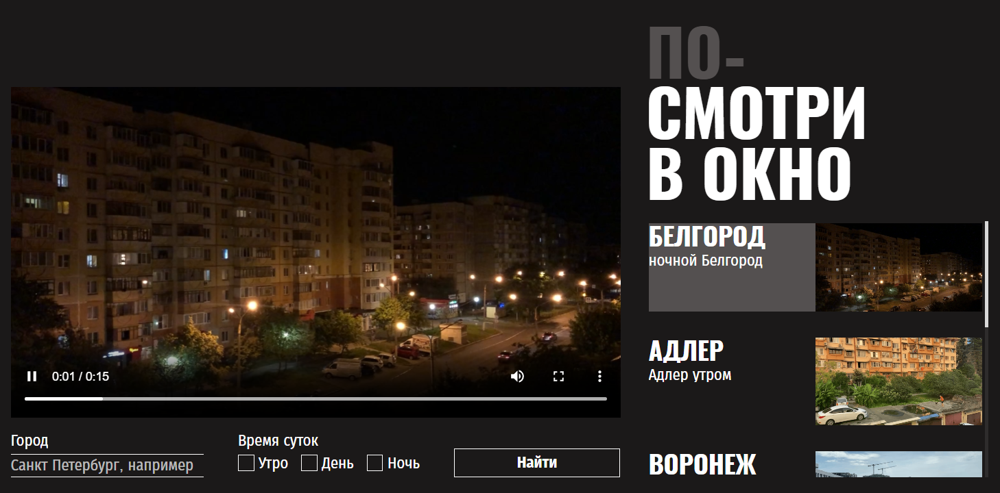

<h1 align="center">Hi there, I'm <a href="https://github.com/eeugene152/" target="_blank">Eugene Emelkhovsky</a> 
</h1>
<h3 align="center">Front learner from Russia 🇷🇺</h3>

# Проект «Посмотри в окно» — описание:
«Посмотри в окно» — это интерактивный сервис городских онлайн-пейзажей. Пользователь может выбрать город через поиск или в списке справа, после чего на странице мгновенно меняется панорамное видео.
## Адрес на GIT
### https://github.com/eeugene152/posmotri-v-okno-fd

Мой второй проект в рамках обучения веб-разработке. это «Медиа-витрина с динамическим контентом», сверстанная по макету из *Figma* с акцентом на точность реализации (*Pixel Perfect*) и использование современных инструментов CSS.

## 🎯 Цели проекта
- Реализовать верстку сложного интерфейса строго по макету из Figma.
- Обеспечить визуальную поддержку всех сценариев работы: поиск города, выбор из списка, ожидание загрузки (прелоадеры).
- Добиться максимального совпадения с дизайном (использование техники *Pixel Perfect*).

## 🛠 Технологии в проекте
- **HTML5** & **CSS3** — основа разметки и стилизации.
- **Flexbox** — на нем построена вся сетка: и главные блоки, и карточки в списке, и элементы формы.
- **БЭМ** (**BEM**) — методология именования классов для порядка в коде.
- **Google Fonts** — подключение и настройка шрифтов *Oswald* и *Fira Sans*.

## 🚀 Особенности реализации
- **Работа с состояниями**: проработка интерактивности через псевдоклассы `:hover`, `:active` и `:focus-visible`. Использована комбинация `:not()` и псевдоэлементов для создания сложных визуальных эффектов без «дерганья» верстки..
- **Кастомные формы и инпуты**: Полная замена стандартных браузерных чекбоксов на уникальные элементы из макета. Реализована связка родитель-потомок через селектор `:has()` для управления стилем лейбла при фокусе на скрытом инпуте.
- **Борьба с системными стилями**: Решена проблема «грязного» автозаполнения браузера через `-webkit-autofill` — кастомизированы цвета фона и текста внутри полей. Также реализовано элегантное перекрытие стандартных рамок фокуса за счет их перекрашивания в цвет темы.
- **Позиционирование прелоадеров**: Точечное наложение индикаторов загрузки поверх конкретных контейнеров данных (`.result__video-container` и `.content__list-container`) за счет создания контекста позиционирования.
- **Типографика**: Для описаний применен `-webkit-line-clamp` (4 строки) с автоматическим троеточием.
- **Декоративные рамки**: Использование псевдоэлементов `::before` для отрисовки дополнительных контуров кнопок, что позволило реализовать требования макета без изменения физических размеров элементов.

## 📈 Чему я научился
1. **Верстать «пиксель в пиксель»**, соблюдая все отступы и размеры из *Figma*.
2. **Работать с псевдоклассами**: (`:focus-visible`, `:active`, `:has`) для создания живого, откликающегося интерфейса. Комбинировать `:nth-child`, `:not()` и `:has()` для точечного управления стилями без лишних классов в HTML.
3. **Управлять каскадом и специфичностью**: осознанно применять `inherit` для наследования стилей в формах и понимать механику работы `!important`.
4. **Контролировать медиа-контент**: использовать `object-fit` и `object-position` для корректного отображения видеопанорам и превью.
5. **Кастомизировать UI-компоненты**: переопределять глубокие браузерные настройки (автозаполнение, стандартные рамки фокуса).

## 🛠 Рефакторинг и оптимизация (после ревью)
Проект прошел этап переработки кода для соответствия современным стандартам верстки:
- Отказ от «магических чисел»: Из основных контейнеров (`.content`, `.search-form`, `.content__details`) удалена фиксированная высота (`height`). Теперь высота блоков адаптивно подстраивается под объем контента, что исключает его обрезание.
- Внедрение CSS-переменных (`:root`): Все ключевые цвета и параметры шрифтов вынесены в переменные. Это позволило избавиться от дублирования значений и обеспечило легкую смену темы оформления.
- Изменен подход к кнопкам: Создана единая «общая сущность» `.button`, т.к. стилизация кнопок и интерактивных состояний кнопок с текстом однотипна в проекте. Таким образома все интерактивные состояния (`hover`, `focus`, `active`) описаны один раз, что сократило объем CSS-кода и упростило поддержку.
- Работа с каскадом и наследованием: Вместо жесткого прописывания стилей для каждого элемента использованы ключевые слова `inherit` и `currentColor`. Это позволило элементам форм и ссылкам автоматически подстраиваться под общую стилистику страницы.
- Решение проблем `Layout Shift` - она проявилась в момент удаления жестко заданной высоты блоков: Применена компенсация изменения высоты кнопок при фокусе через отрицательные отступы (`margin-top`). Это позволило сохранить визуальный эффект из макета без «прыжков» соседних элементов.
- Повышение доступности: Исправлены ошибки с принудительным скрытием контента (`overflow-x: hidden`), что вскрыло дополнительные проблемы с паразитным скроллбаром. Проблему решешил через проверку и перерасчет отступов блоков.

### [Посмотреть проект на GitHub](https://github.com/eeugene152/posmotri-v-okno-fd)
# Авторство:
- Яндекс Практикум (https://practicum.yandex.ru/)
- GitHub: [@eeugene152](https://github.com/eeugene152/)
- Telegram: [@eemelkhovsky](https://t.me/eemelkhovsky/)

-----
*Проект выполнен в учебных целях.*
